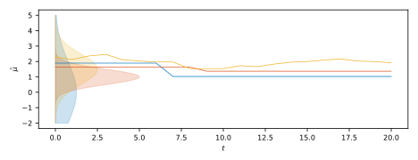

# LILUCB implementation

Implementation exercise for the best-arm identification algorithm described in [1].

$x^2 \log(x)$

## References
[1] Jamieson, K., Malloy, M., Nowak, R., & Bubeck, S. (2014, May). lil’UCB: An optimal exploration algorithm for multi-armed bandits. In Conference on Learning Theory (pp. 423-439).
